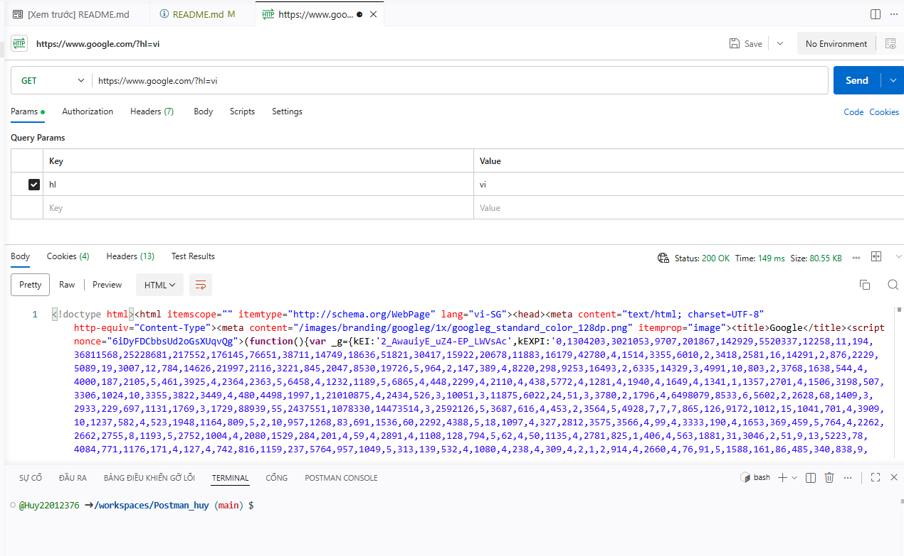
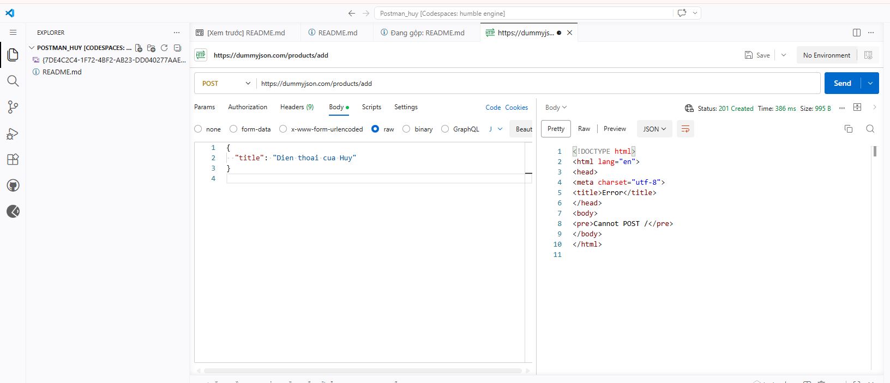
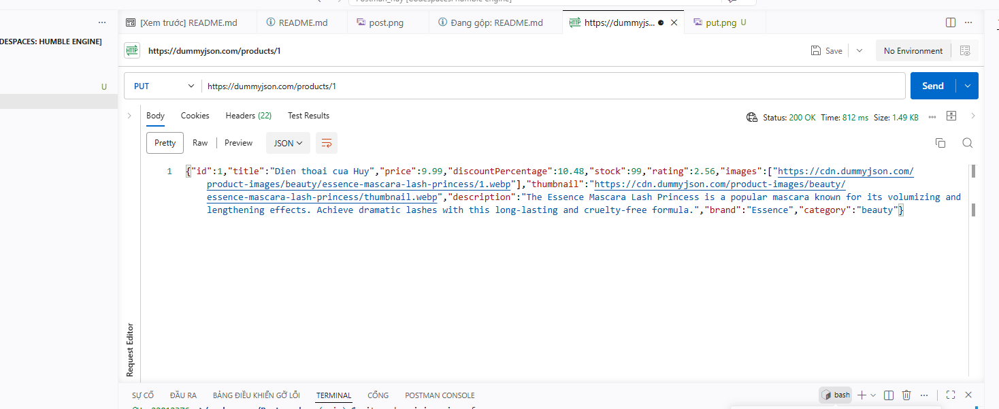
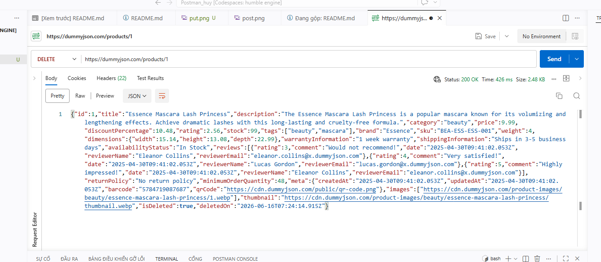

# Báo cáo Thực hành Kiểm thử API với Postman

## 1. Thông tin sinh viên
- **Họ và tên:** Nguyễn Viết Huy
- **Mã sinh viên:** 22012376

## 2. Kết quả thực hiện đầy đủ các phương thức API

### A. Phương thức GET (Lấy dữ liệu)
- **URL thử nghiệm:** `https://google.com`
- **Mã trạng thái trả về:** `200 OK`

### B. Phương thức POST (Tạo dữ liệu mới)
- **URL thử nghiệm:** `https://dummyjson.com`
- **Mã trạng thái trả về:** `201 Created`

### C. Phương thức PUT (Cập nhật dữ liệu)
- **URL thử nghiệm:** `https://dummyjson.com`
- **Mã trạng thái trả về:** `200 OK`

### D. Phương thức DELETE (Xóa dữ liệu)
- **URL thử nghiệm:** `https://dummyjson.com`
- **Mã trạng thái trả về:** `200 OK`

